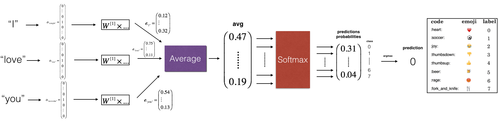

# Emojify-using-word-vector-embeddings
The code is in Python3  

### Model Overview 
 
 
 * Inputs and outputs

    * The input of the model is a string corresponding to a sentence (e.g. "I love you).
    * The output will be a probability vector of shape (1,5), (there are 5 emojis to choose from).
    * The (1,5) probability vector is passed to an argmax layer, which extracts the index of the emoji with the highest probability.

We use pretrained 50-dimensional GloVe embeddings to convert each sentence into their word vector representations. 
  
 
 ### Note
 It is advisable to download the pretrained 50-dimensional GloVe embeddings (download from  ) and replace it with the **glove.6B.50d.txt** file in **data** directory.  
